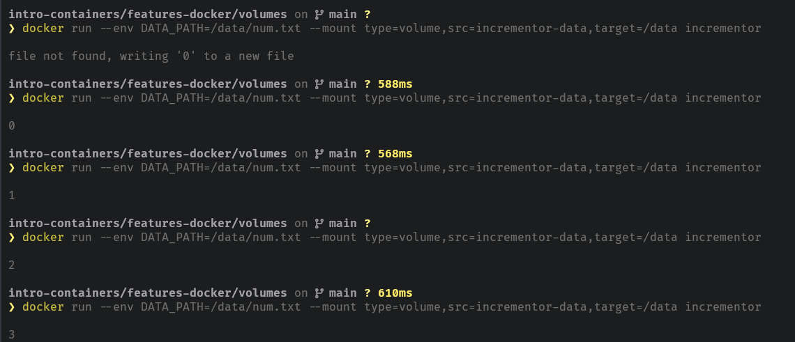

# Volumes

Docker volumes are a mechanism to persist data generated by and used by Docker containers. Unlike [bind mounts](../bind-mounts/README.md) (which mount a directory or file from the host into the container), volumes are entirely managed by Docker itself.

# Why Use Volumes? 

**Persistence**: Data stored in a volume persists even after the container is stopped or removed. This contrasts with the ephemeral nature of a container's filesystem, which is reset when the container is destroyed.

**Data Sharing**: Volumes can be shared and reused among containers. A volume can be mounted into multiple containers simultaneously.

**Portability**: Since Docker manages volumes, they can be easily backed up, migrated, or restored without needing to worry about host-specific paths, as is the case with bind mounts.

**Performance**: Docker volumes can offer better performance for I/O operations compared to bind mounts.

**Storage Drivers**: Volumes can leverage various storage drivers provided by Docker, like local, overlay2, or third-party plugins.

So if you have a container that runs and the next time it runs it needs the results from the previous time it ran, volumes are going to be helpful.

# Practicing

In this folder there are two files, the [index.js](./index.js) and [Dockerfile](./Dockerfile).

Every time that you run the container it will increment the console. 

```shell
docker build --tag=incrementor . # building the container 

docker run incrementor # running the container 
```

As you can see, it will show the same log every time and won't store nothing. Because the volumes are not defined, so every time that you use docker run the storage will be the same: 0

Now, try this: 

```shell 
docker run --env DATA_PATH=/data/num.txt --mount type=volume,src=incrementor-data,target=/data incrementor
```

With this command, every time that you run it will increment the data and store inside the volume. 



# Break down the command

## 1. docker run
This is the basic command to start a new Docker container from a specified image.

## 2. --env DATA_PATH=/data/num.txt
- --env: This flag is used to set environment variables inside the container.

DATA_PATH=/data/num.txt: This sets an environment variable named DATA_PATH with the value /data/num.txt. The application or script inside the container can then use this environment variable. For example, it might be a path where the application expects to find (or create) a specific file.

## 3. --mount type=volume,src=incrementor-data,target=/data
This flag tells Docker to mount a storage source to a specified target path inside the container. The specific storage mechanism used here is a volume.

- type=volume: Specifies that the mount type is a volume (as opposed to a bind mount or tmpfs).

- src=incrementor-data: This is the source volume name. If a volume named incrementor-data doesn't already exist, Docker will create one for you.

- target=/data: This is the directory inside the container where the volume will be mounted. So, everything that the container writes to /data will be stored in the incrementor-data volume on the host.

## 4. incrementor
This is the name of the Docker image that the container will be based on and run. The functionality of this image isn't described in the command, but given its name and the other flags, it's plausible that this container could "increment" some data in a file (possibly located at /data/num.txt based on the DATA_PATH environment variable).
